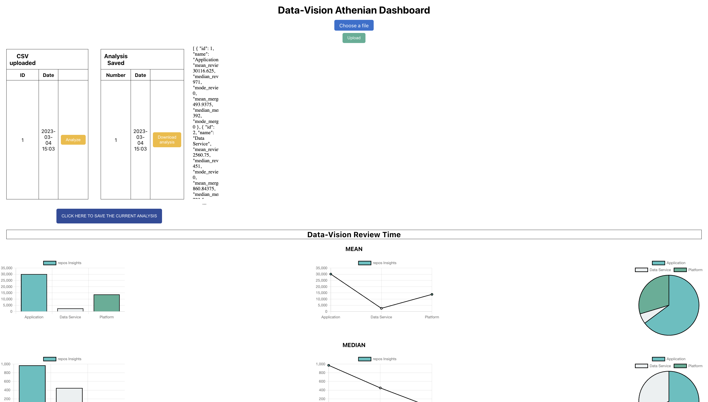
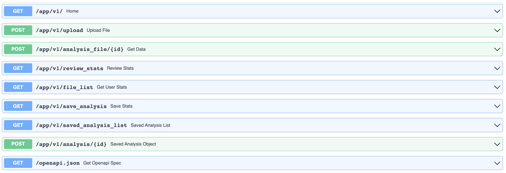

# Datavision-athenian-api
This is a RESTful API server that enables users to upload CSV data, view summary statistics, create visualization. Is designed to be scalable and high-performing. It provides a range of visualisation options as charts, bar charts, and scatter plots.



# How to deploy Data-Vision Athenian API

### Docker image

```
docker-compose build
docker-compose up

```

### Initialization
In a different terminal
```
docker-compose run app alembic revision --autogenerate -m "New Migration"
docker-compose run app alembic upgrade head
```

### Server

The docker compose will automatically start the servers on the following ports:

- `BACKEND-DOCS` http://localhost:8000/docs  : Here you will be able to see the api
- `FRONTEND-DASHBOARD` http://localhost:3000 : Here you will be able to see the dashboard
- `PGADMIN-DATABASE` http://localhost:5050/  : Here you will be able to access to pg admin for the database 


### Environment

The server requires:
as this is a test the .env file is in the repo (not for prod environments)
.
- `DATABASE_URL`  refers to the URL or connection string used to connect to a database PostgreSQ.
- `DB_USER` environment variable with the passphrase for encrypting invitation URLs.
- `DB_PASSWORD` efers to the password used to connect to a database.
- `DB_NAME` refers to the name of a databas.
- `PGADMIN_EMAIL` refers to the email address of a PostgreSQL admin user.
- `PGADMIN_PASSWORD` refers to the password of a PostgreSQL admin user,.


### API
Finally I let a picture of the API

